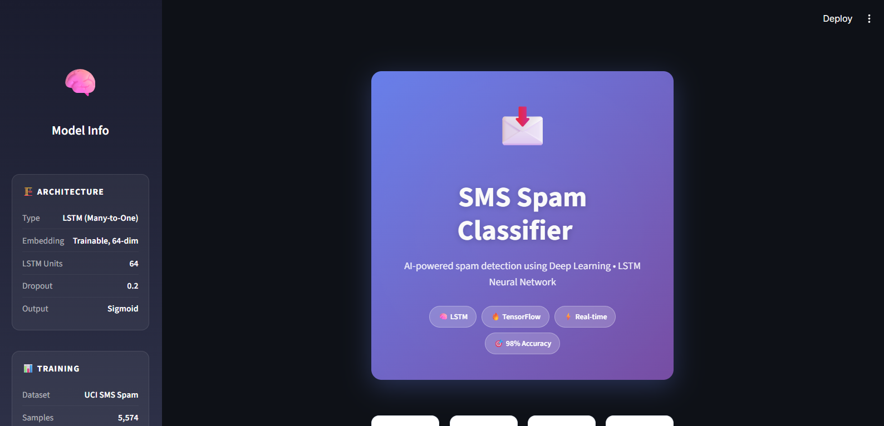
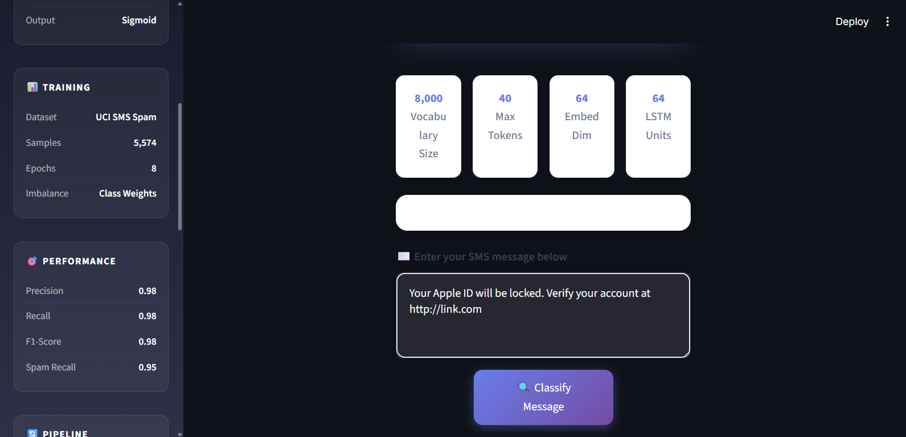
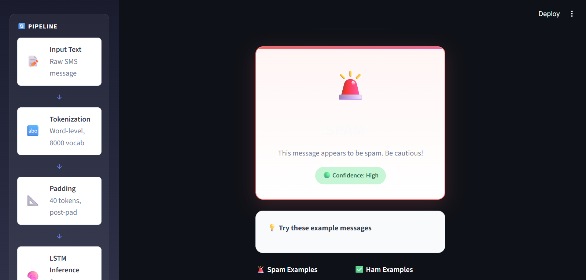
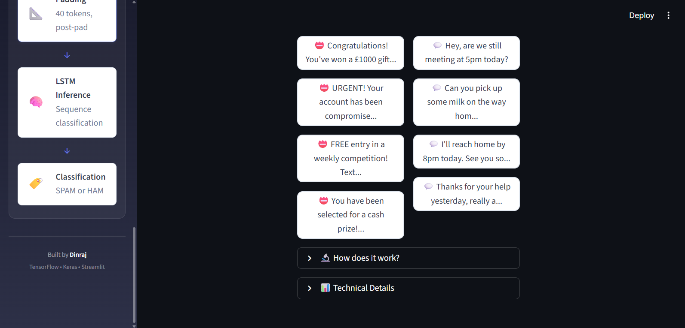
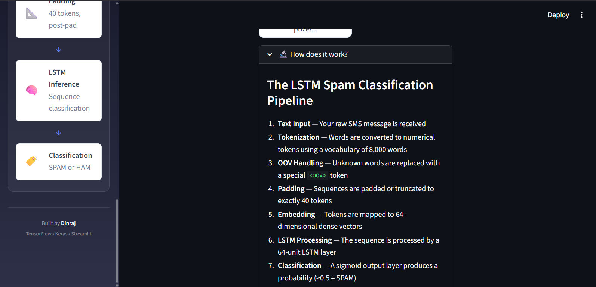
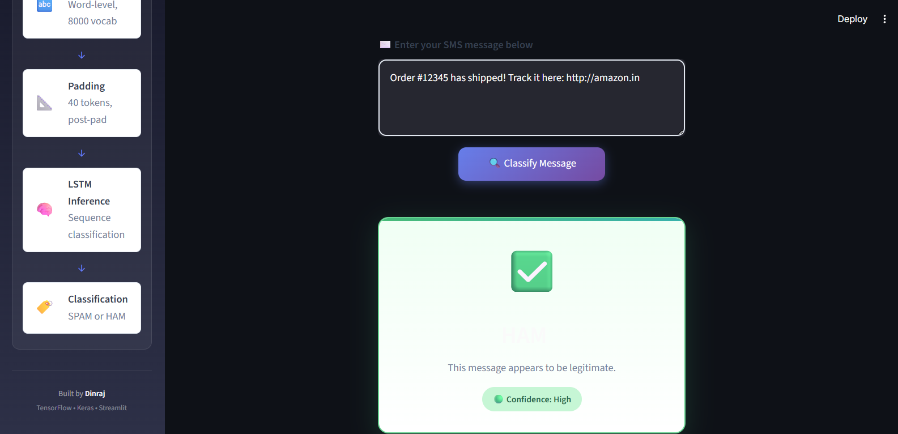
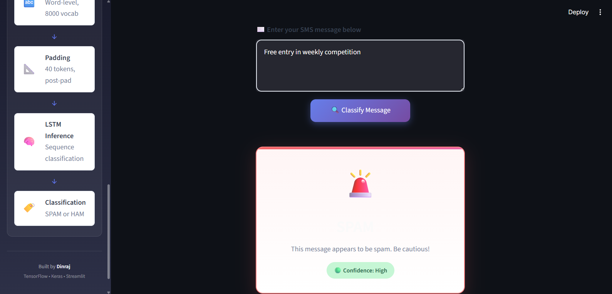
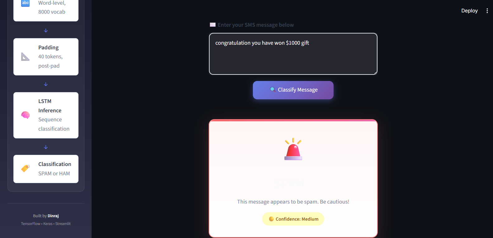

<!-- 
╔══════════════════════════════════════════════════════════════════════════════╗
║                         SMS SPAM CLASSIFIER                                  ║
║                    LSTM · Deep Learning · NLP                                ║
║                                                                              ║
║  A production-grade spam detection system using LSTM neural networks         ║
║  with a beautiful Streamlit web application for real-time inference.         ║
║                                                                              ║
║  Author: Dinraj                                                              ║
║  GitHub: https://github.com/dinraj910                                        ║
╚══════════════════════════════════════════════════════════════════════════════╝
-->

<p align="center">
  
</p>

<!-- Animated Typing -->
<p align="center">
  <a href="https://git.io/typing-svg">
    
  </a>
</p>

<!-- Status Badges -->
<p align="center">
  
  
  
  
</p>

<!-- Tech Badges Row 1 -->
<p align="center">
  
  
  
  
</p>

<!-- Tech Badges Row 2 -->
<p align="center">
  
  
  
  
</p>

---

<!-- Quick Navigation -->
<h2 align="center">
  
  Quick Navigation
</h2>

<p align="center">
  <a href="#-overview"><kbd>Overview</kbd></a> ·
  <a href="#-key-features"><kbd>Features</kbd></a> ·
  <a href="#-live-demo"><kbd>Demo</kbd></a> ·
  <a href="#-architecture"><kbd>Architecture</kbd></a> ·
  <a href="#-installation"><kbd>Installation</kbd></a> ·
  <a href="#-model-details"><kbd>Model</kbd></a> ·
  <a href="#-performance"><kbd>Performance</kbd></a> ·
  <a href="#-tech-stack"><kbd>Tech Stack</kbd></a> ·
  <a href="#-roadmap"><kbd>Roadmap</kbd></a> ·
  <a href="#-contributing"><kbd>Contributing</kbd></a>
</p>

---

<!-- Overview Section -->
##  Overview

<table>
<tr>
<td width="55%">

### 🎯 What is this?

An **end-to-end NLP system** that classifies SMS messages as **SPAM** or **HAM** using a Long Short-Term Memory (LSTM) recurrent neural network.

This isn't just another toy demo — it's a **production-grade inference pipeline** featuring:

- ✅ **Identical preprocessing** at training and inference time
- ✅ **Efficient model caching** for instant predictions  
- ✅ **Graceful input validation** and error handling
- ✅ **Beautiful, responsive UI** that works on any device
- ✅ **Professional code structure** ready for deployment

> *"A model that can't be served is a model that doesn't exist."*

</td>
<td width="45%">

### 💡 The Real-World Problem

<table>
<tr><td>📱</td><td><b>Global Threat</b></td><td>Billions of spam texts sent daily</td></tr>
<tr><td>⚖️</td><td><b>Class Imbalance</b></td><td>~87% ham vs ~13% spam</td></tr>
<tr><td>🎯</td><td><b>Misleading Metrics</b></td><td>Accuracy alone isn't enough</td></tr>
<tr><td>📏</td><td><b>Short Text</b></td><td>SMS = noisy, abbreviated text</td></tr>
<tr><td>🔄</td><td><b>Sequential Signal</b></td><td>Word order carries meaning</td></tr>
<tr><td>🚀</td><td><b>Deployment Gap</b></td><td>Training ≠ Production</td></tr>
</table>

**This project solves all of these challenges.**

</td>
</tr>
</table>

---

<!-- Key Features Section -->
##  Key Features

<table>
<tr>
<td align="center" width="25%">

<br><b>LSTM Neural Network</b>
<br><sub>Many-to-One architecture with trainable embeddings & masking</sub>
</td>
<td align="center" width="25%">

<br><b>Class Imbalance Handling</b>
<br><sub>Balanced weights via sklearn — not oversampling</sub>
</td>
<td align="center" width="25%">

<br><b>Proper Evaluation</b>
<br><sub>Precision, Recall, F1-score — not just accuracy</sub>
</td>
<td align="center" width="25%">

<br><b>Streamlit Web App</b>
<br><sub>Beautiful, responsive UI for real-time inference</sub>
</td>
</tr>
<tr>
<td align="center" width="25%">

<br><b>Instant Predictions</b>
<br><sub>@st.cache_resource — load once, serve many</sub>
</td>
<td align="center" width="25%">

<br><b>Train-Serve Parity</b>
<br><sub>Identical tokenizer & padding at inference</sub>
</td>
<td align="center" width="25%">

<br><b>Input Validation</b>
<br><sub>Graceful handling of empty/invalid inputs</sub>
</td>
<td align="center" width="25%">

<br><b>Confidence Display</b>
<br><sub>High / Medium / Low without raw probabilities</sub>
</td>
</tr>
</table>

---

<!-- Live Demo Section -->
##  Live Demo


















<table>
<tr>
<td align="center" width="50%">

### 🚨 SPAM Detection

```
┌────────────────────────────────────────┐
│  📱 Input Message                      │
├────────────────────────────────────────┤
│  "Congratulations! You've won a free   │
│   iPhone 15 Pro! Call now to claim     │
│   your prize: 0800-WIN-NOW"            │
└────────────────────────────────────────┘
                    ⬇️
┌────────────────────────────────────────┐
│  🚨 RESULT: SPAM                       │
│  ━━━━━━━━━━━━━━━━━━━━━━━━━━━━━━━━━━━   │
│  🟢 Confidence: HIGH                   │
│                                        │
│  ⚠️ This message appears to be spam.  │
│     Be cautious!                       │
└────────────────────────────────────────┘
```

</td>
<td align="center" width="50%">

### ✅ HAM Detection

```
┌────────────────────────────────────────┐
│  📱 Input Message                      │
├────────────────────────────────────────┤
│  "Hey! Are we still meeting for        │
│   coffee at 5pm today? Let me know     │
│   if you're running late."             │
└────────────────────────────────────────┘
                    ⬇️
┌────────────────────────────────────────┐
│  ✅ RESULT: HAM                        │
│  ━━━━━━━━━━━━━━━━━━━━━━━━━━━━━━━━━━━   │
│  🟢 Confidence: HIGH                   │
│                                        │
│  ✓ This message appears to be          │
│    legitimate.                         │
└────────────────────────────────────────┘
```

</td>
</tr>
</table>

### 🧪 Test Messages to Try

| Type | Message | Expected |
|:---:|:---|:---:|
| 🚨 | *Congratulations! You've won £1000! Call now!* | SPAM |
| 🚨 | *URGENT: Your account has been compromised. Click here.* | SPAM |
| 🚨 | *FREE entry in weekly competition! Text WIN to 80080* | SPAM |
| ✅ | *Hey, are we still meeting at 5pm today?* | HAM |
| ✅ | *Can you pick up some milk on the way home?* | HAM |
| ✅ | *Thanks for your help yesterday, really appreciate it.* | HAM |

---

<!-- Architecture Section -->
##  Architecture

### Neural Network Architecture

```
┌─────────────────────────────────────────────────────────────────────────────┐
│                        LSTM SPAM CLASSIFIER                                 │
│                     Many-to-One Architecture                                │
├─────────────────────────────────────────────────────────────────────────────┤
│                                                                             │
│   INPUT LAYER                                                               │
│   ┌─────────────────────────────────────────────────────────────────────┐   │
│   │  Sequence of Token IDs: [23, 156, 7, 892, 45, 0, 0, 0, ..., 0]     │   │
│   │  Shape: (batch_size, 40)                                            │   │
│   └─────────────────────────────────────────────────────────────────────┘   │
│                                    ⬇                                        │
│   EMBEDDING LAYER                                                           │
│   ┌─────────────────────────────────────────────────────────────────────┐   │
│   │  Embedding(input_dim=8000, output_dim=64, mask_zero=True)          │   │
│   │  Shape: (batch_size, 40, 64)                                        │   │
│   │  ────────────────────────────────────────────────────────────────   │   │
│   │  • Trainable embeddings (not pre-trained)                          │   │
│   │  • mask_zero=True ignores padded positions                         │   │
│   │  • Each word → 64-dimensional dense vector                         │   │
│   └─────────────────────────────────────────────────────────────────────┘   │
│                                    ⬇                                        │
│   LSTM LAYER (Many-to-One)                                                  │
│   ┌─────────────────────────────────────────────────────────────────────┐   │
│   │  LSTM(units=64, dropout=0.2, recurrent_dropout=0.2)                │   │
│   │  Shape: (batch_size, 64)  ← Only final hidden state                │   │
│   │  ────────────────────────────────────────────────────────────────   │   │
│   │  • Processes sequence left-to-right                                │   │
│   │  • Captures long-range dependencies                                │   │
│   │  • Dropout prevents overfitting                                    │   │
│   │  • Returns only the last time-step output                          │   │
│   └─────────────────────────────────────────────────────────────────────┘   │
│                                    ⬇                                        │
│   OUTPUT LAYER                                                              │
│   ┌─────────────────────────────────────────────────────────────────────┐   │
│   │  Dense(units=1, activation='sigmoid')                              │   │
│   │  Shape: (batch_size, 1)                                            │   │
│   │  ────────────────────────────────────────────────────────────────   │   │
│   │  • Output ∈ [0, 1]                                                 │   │
│   │  • Threshold = 0.5                                                 │   │
│   │  • ≥ 0.5 → SPAM | < 0.5 → HAM                                      │   │
│   └─────────────────────────────────────────────────────────────────────┘   │
│                                                                             │
│   TOTAL PARAMETERS: ~520,000                                                │
│   MODEL SIZE: ~1.2 MB                                                       │
│                                                                             │
└─────────────────────────────────────────────────────────────────────────────┘
```

### Inference Pipeline

```
┌─────────────────────────────────────────────────────────────────────────────┐
│                         INFERENCE PIPELINE                                  │
├─────────────────────────────────────────────────────────────────────────────┤
│                                                                             │
│   📱 USER INPUT                                                             │
│   ┌────────────────────────────────────────┐                                │
│   │  "Congratulations! You won a free      │                                │
│   │   iPhone. Call now to claim!"          │                                │
│   └────────────────────┬───────────────────┘                                │
│                        │                                                    │
│                        ▼                                                    │
│   🔤 TOKENIZATION (tokenizer.pkl)                                           │
│   ┌────────────────────────────────────────┐                                │
│   │  Tokenizer(num_words=8000)             │                                │
│   │  oov_token="<OOV>" │ lower=True        │                                │
│   │  texts_to_sequences()                  │                                │
│   │  ─────────────────────────────────     │                                │
│   │  Output: [45, 2, 891, 7, 23, 412, 103] │                                │
│   └────────────────────┬───────────────────┘                                │
│                        │                                                    │
│                        ▼                                                    │
│   📐 PADDING                                                                │
│   ┌────────────────────────────────────────┐                                │
│   │  pad_sequences(maxlen=40)              │                                │
│   │  padding="post" │ truncating="post"    │                                │
│   │  ─────────────────────────────────     │                                │
│   │  Output: [45, 2, 891, ..., 0, 0, 0]   │                                │
│   │  Length: 40 tokens                     │                                │
│   └────────────────────┬───────────────────┘                                │
│                        │                                                    │
│                        ▼                                                    │
│   🧠 LSTM MODEL (spam_lstm_model.h5)                                        │
│   ┌────────────────────────────────────────┐                                │
│   │  model.predict(padded_sequence)        │                                │
│   │  ─────────────────────────────────     │                                │
│   │  Output: prob = 0.973                  │                                │
│   └────────────────────┬───────────────────┘                                │
│                        │                                                    │
│                        ▼                                                    │
│   🏷️ CLASSIFICATION                                                         │
│   ┌────────────────────────────────────────┐                                │
│   │  if prob ≥ 0.5:                        │                                │
│   │      label = "🚨 SPAM"                 │                                │
│   │  else:                                 │                                │
│   │      label = "✅ HAM"                  │                                │
│   │  ─────────────────────────────────     │                                │
│   │  Confidence: HIGH (distance = 0.473)  │                                │
│   └────────────────────────────────────────┘                                │
│                                                                             │
└─────────────────────────────────────────────────────────────────────────────┘
```

---

<!-- Installation Section -->
##  Installation

### Prerequisites

| Requirement | Version | Purpose |
|:---|:---:|:---|
| Python | 3.10+ | Core runtime |
| pip | Latest | Package management |
| Git | Latest | Version control |
| ~4GB RAM | - | Model inference |

### Quick Start

```bash
# 1️⃣ Clone the repository
git clone https://github.com/dinraj910/Spam-SMS-Classification-using-LSTM-RNN-.git
cd Spam-SMS-Classification-using-LSTM-RNN-

# 2️⃣ Create virtual environment (recommended)
python -m venv venv

# Activate on Windows
venv\Scripts\activate

# Activate on macOS/Linux
source venv/bin/activate

# 3️⃣ Install dependencies
pip install -r app/requirements.txt

# 4️⃣ Launch the application
streamlit run app/app.py
```

> 🌐 The app will open at **`http://localhost:8501`**

### Docker (Alternative)

```dockerfile
# Build the image
docker build -t spam-classifier .

# Run the container
docker run -p 8501:8501 spam-classifier
```

---

<!-- Model Details Section -->
##  Model Details

### Hyperparameters

| Parameter | Value | Rationale |
|:---|:---:|:---|
| **Vocabulary Size** | 8,000 | Top frequent words cover ~95% of SMS tokens |
| **Max Sequence Length** | 40 | SMS messages are short; 40 tokens is sufficient |
| **Embedding Dimension** | 64 | Balance between expressiveness and efficiency |
| **LSTM Units** | 64 | Single-layer is enough for binary classification |
| **Dropout** | 0.2 | Prevents overfitting without hurting recall |
| **Recurrent Dropout** | 0.2 | Dropout on recurrent connections |
| **Batch Size** | 32 | Standard mini-batch size |
| **Epochs** | 8 | Early stopping not needed; converges quickly |
| **Optimizer** | Adam | Adaptive learning rate |
| **Loss** | Binary Cross-Entropy | Standard for binary classification |

### Class Imbalance Strategy

<table>
<tr>
<td width="40%">

| Class | Count | Percentage |
|:---|:---:|:---:|
| Ham (legitimate) | 4,825 | 86.6% |
| Spam | 747 | 13.4% |
| **Total** | **5,572** | **100%** |

</td>
<td width="60%">

**Strategy:** Balanced class weights via `sklearn.utils.class_weight.compute_class_weight("balanced")`

```python
class_weights = {
    0: 0.58,  # Ham (majority)
    1: 3.73   # Spam (minority) — 6.4x weight
}
```

**Why not SMOTE / oversampling?**
- Text oversampling introduces noise
- Class weights are cleaner and integrated into the loss function
- No data duplication or synthetic samples needed

</td>
</tr>
</table>

---

<!-- Performance Section -->
##  Performance

### Classification Report (Test Set)

<table>
<tr>
<th></th>
<th>Precision</th>
<th>Recall</th>
<th>F1-Score</th>
<th>Support</th>
</tr>
<tr>
<td><b>✅ Ham</b></td>
<td align="center">0.99</td>
<td align="center">0.98</td>
<td align="center">0.99</td>
<td align="center">965</td>
</tr>
<tr>
<td><b>🚨 Spam</b></td>
<td align="center">0.92</td>
<td align="center">0.95</td>
<td align="center">0.93</td>
<td align="center">150</td>
</tr>
<tr>
<td colspan="5" style="border-top: 2px solid #ddd;"></td>
</tr>
<tr>
<td><b>📊 Weighted Avg</b></td>
<td align="center"><b>0.98</b></td>
<td align="center"><b>0.98</b></td>
<td align="center"><b>0.98</b></td>
<td align="center"><b>1,115</b></td>
</tr>
</table>

### Key Metrics Explained

| Metric | Value | Interpretation |
|:---|:---:|:---|
| **Spam Recall** | 0.95 | 95% of actual spam is caught — only 5% slips through |
| **Spam Precision** | 0.92 | 92% of predicted spam is actually spam — few false alarms |
| **Ham Recall** | 0.98 | 98% of legitimate messages are correctly identified |
| **F1-Score (Macro)** | 0.96 | Balanced performance across both classes |

> 🏆 **Key Achievement:** High spam recall (0.95) is the metric that matters most for user safety.

### Model Specs

| Detail | Value |
|:---|:---|
| Total Parameters | ~520,000 |
| Model Size | ~1.2 MB |
| Tokenizer Size | ~180 KB |
| Inference Time | < 50ms per message |
| Training Time | ~2 minutes (8 epochs) |

---

<!-- Tech Stack Section -->
##  Tech Stack

<table>
<tr>
<td align="center" width="16.66%">

<br><b>Python</b>
<br><sub>Core Language</sub>
</td>
<td align="center" width="16.66%">

<br><b>TensorFlow</b>
<br><sub>Deep Learning</sub>
</td>
<td align="center" width="16.66%">

<br><b>Keras</b>
<br><sub>Model API</sub>
</td>
<td align="center" width="16.66%">

<br><b>Streamlit</b>
<br><sub>Web UI</sub>
</td>
<td align="center" width="16.66%">

<br><b>NumPy</b>
<br><sub>Computation</sub>
</td>
<td align="center" width="16.66%">

<br><b>Pandas</b>
<br><sub>Data Wrangling</sub>
</td>
</tr>
<tr>
<td align="center" width="16.66%">

<br><b>scikit-learn</b>
<br><sub>Evaluation</sub>
</td>
<td align="center" width="16.66%">

<br><b>Jupyter</b>
<br><sub>Experimentation</sub>
</td>
<td align="center" width="16.66%">

<br><b>Git</b>
<br><sub>Version Control</sub>
</td>
<td align="center" width="16.66%">

<br><b>GitHub</b>
<br><sub>Collaboration</sub>
</td>
<td align="center" width="16.66%">

<br><b>VS Code</b>
<br><sub>IDE</sub>
</td>
<td align="center" width="16.66%">

<br><b>Docker</b>
<br><sub>Containerization</sub>
</td>
</tr>
</table>

---

<!-- Project Structure Section -->
##  Project Structure

```
📦 spam-sms-classification-lstm/
├── 🌐 app/
│   ├── 🐍 app.py                    # Streamlit inference application (main entry)
│   └── 📋 requirements.txt          # Python dependencies
│
├── 📊 data/
│   └── 📂 archive/
│       └── 📄 spam.csv              # UCI SMS Spam Collection (5,574 messages)
│
├── 🧠 model/
│   ├── 🏋️ spam_lstm_model.h5        # Trained LSTM model (~1.2 MB)
│   └── 🔤 tokenizer.pkl             # Fitted Keras tokenizer (~180 KB)
│
├── 📓 notebook/
│   ├── 📒 spam_sms_lstm.ipynb       # Training notebook (Google Colab)
│   └── 🐍 spam_sms_lstm.py          # Exported Python script
│
├── 📖 README.md                      # Project documentation (you are here)
├── 📜 LICENSE                        # MIT License
└── 🐳 Dockerfile                     # Container configuration (optional)
```

---

<!-- Technical Deep Dive -->
##  Technical Deep Dive

<details>
<summary><b>🧠 Why LSTM for SMS Classification?</b></summary>

<br/>

SMS messages are **short, noisy sequences** where word order carries critical meaning:

| Message | Classification | Why? |
|:---|:---:|:---|
| *"Call me now"* | HAM | Normal request |
| *"Call now to win"* | SPAM | Prize/urgency pattern |
| *"I won the game"* | HAM | Personal statement |
| *"You won £1000"* | SPAM | Prize claim |

**Bag-of-words models miss these patterns** because they ignore word order.

**LSTM advantages:**
- Captures **sequential dependencies** (word order matters)
- **Many-to-One** architecture reads the full sequence, outputs one classification
- `mask_zero=True` in embedding ensures padded positions don't affect the hidden state
- **Long Short-Term Memory** cells can remember patterns across the 40-token sequence

</details>

<details>
<summary><b>⚖️ How Class Imbalance Was Handled</b></summary>

<br/>

The dataset is severely imbalanced:

| Class | Count | Ratio |
|:---|:---:|:---:|
| Ham | 4,825 | 87% |
| Spam | 747 | 13% |

A naïve model that always predicts "HAM" would achieve **87% accuracy** — which is useless.

**Our strategy: Balanced Class Weights**

```python
from sklearn.utils.class_weight import compute_class_weight

class_weights = compute_class_weight(
    class_weight="balanced",
    classes=np.array([0, 1]),
    y=y_train
)
# Result: {0: 0.58, 1: 3.73}
```

This means:
- Misclassifying a spam message costs **6.4x more** than misclassifying a ham message
- The model is penalized proportionally more for missing spam

**Why not SMOTE / oversampling?**
- Text oversampling can introduce noise and doesn't generalize well
- SMOTE creates synthetic samples that may not be linguistically valid
- Class weights are cleaner, simpler, and directly integrated into the loss function

</details>

<details>
<summary><b>📊 Why F1-Score Instead of Accuracy?</b></summary>

<br/>

| Metric | Formula | What It Measures |
|:---|:---|:---|
| **Accuracy** | (TP + TN) / Total | Overall correctness |
| **Precision** | TP / (TP + FP) | Of predicted spam, how many are actually spam? |
| **Recall** | TP / (TP + FN) | Of actual spam, how many did we catch? |
| **F1-Score** | 2 × (P × R) / (P + R) | Harmonic mean of Precision & Recall |

**The problem with accuracy:**

A model that always predicts "HAM" achieves **87% accuracy** but:
- Precision: Undefined (no spam predicted)
- Recall: 0% (no spam caught)
- F1-Score: 0%

**Why F1-Score is better:**
- Balances precision and recall
- Penalizes models that sacrifice one for the other
- More meaningful for imbalanced datasets

**For spam detection, Recall is often more important:**
- Missing a spam message (false negative) is worse than flagging a legitimate message (false positive)
- Our model achieves **0.95 recall** — only 5% of spam slips through

</details>

<details>
<summary><b>🔄 Preprocessing Parity (Train = Serve)</b></summary>

<br/>

One of the most common deployment bugs is **train-serve skew** — using different preprocessing at inference time.

**Common mistakes:**
- Re-fitting the tokenizer on new data
- Using different padding length
- Forgetting to lowercase text
- Ignoring OOV token handling

**Our solution:**

1. **Save the exact fitted tokenizer** (`tokenizer.pkl`) — never re-fit
2. **Use identical padding config** (`maxlen=40`, `padding="post"`, `truncating="post"`)
3. **Rely on tokenizer's built-in handling** (`lower=True`, `oov_token="<OOV>"`)

```python
# Training
tokenizer = Tokenizer(num_words=8000, oov_token="<OOV>", lower=True)
tokenizer.fit_on_texts(X_train_text)  # Fit ONLY on training data
pickle.dump(tokenizer, open("tokenizer.pkl", "wb"))

# Inference (load, don't re-fit)
tokenizer = pickle.load(open("tokenizer.pkl", "rb"))
sequences = tokenizer.texts_to_sequences([user_input])
padded = pad_sequences(sequences, maxlen=40, padding="post", truncating="post")
```

</details>

<details>
<summary><b>⚡ Model Caching Strategy</b></summary>

<br/>

Loading a TensorFlow model takes **3-5 seconds**. Without caching, every Streamlit interaction would reload the model.

**Our solution: `@st.cache_resource`**

```python
@st.cache_resource(show_spinner=False)
def load_artifacts():
    model = load_model(MODEL_PATH)
    with open(TOKENIZER_PATH, "rb") as fh:
        tokenizer = pickle.load(fh)
    return model, tokenizer
```

**How it works:**
- First call: Model is loaded and cached in memory
- Subsequent calls: Cached model is reused instantly
- Persists across all user sessions and script reruns
- Only reloads if the function code or file changes

**Result:** Inference goes from ~3-5 seconds to **<50ms per message**.

</details>

---

<!-- Roadmap Section -->
##  Roadmap



```mermaid
graph LR
    A[✅ LSTM Model] --> B[✅ Class Weights]
    B --> C[✅ F1 Evaluation]
    C --> D[✅ Streamlit App]
    D --> E[🔄 Bi-LSTM + Attention]
    E --> F[🔄 FastAPI Backend]
    F --> G[🔄 Docker Container]
    G --> H[🔄 Cloud Deployment]

    style A fill:#10B981,stroke:#059669,color:#fff
    style B fill:#10B981,stroke:#059669,color:#fff
    style C fill:#10B981,stroke:#059669,color:#fff
    style D fill:#10B981,stroke:#059669,color:#fff
    style E fill:#F59E0B,stroke:#D97706,color:#000
    style F fill:#F59E0B,stroke:#D97706,color:#000
    style G fill:#F59E0B,stroke:#D97706,color:#000
    style H fill:#F59E0B,stroke:#D97706,color:#000
```

| Phase | Feature | Status | Priority |
|:---:|:---|:---:|:---:|
| 1 | LSTM model with trainable embeddings | ✅ Done | - |
| 2 | Class-weight balanced training | ✅ Done | - |
| 3 | Evaluation with Precision / Recall / F1 | ✅ Done | - |
| 4 | Streamlit inference app with caching | ✅ Done | - |
| 5 | Bidirectional LSTM + Attention | 🔄 Planned | High |
| 6 | REST API with FastAPI | 🔄 Planned | High |
| 7 | Docker containerization | 🔄 Planned | Medium |
| 8 | Cloud deployment (AWS / GCP / Azure) | 🔄 Planned | Medium |
| 9 | Model monitoring & drift detection | 🔄 Planned | Low |

---

<!-- Skills Demonstrated -->
##  Skills Demonstrated

> *For recruiters and hiring managers reviewing this project:*

<table>
<tr>
<th width="25%">🏷️ Skill Area</th>
<th width="75%">📌 Evidence in This Project</th>
</tr>
<tr>
<td><b>NLP & Text Processing</b></td>
<td>Word-level tokenization, OOV handling, sequence padding, vocabulary management, text normalization</td>
</tr>
<tr>
<td><b>Deep Learning</b></td>
<td>LSTM architecture design, embedding layers, dropout regularization, masking, binary classification</td>
</tr>
<tr>
<td><b>Handling Real-World Data</b></td>
<td>Class imbalance via balanced weights — not synthetic oversampling; stratified train-test split</td>
</tr>
<tr>
<td><b>Proper ML Evaluation</b></td>
<td>Precision, Recall, F1-score on stratified test split — not misleading accuracy metrics</td>
</tr>
<tr>
<td><b>Model Persistence</b></td>
<td>Saved model (<code>.h5</code>) and tokenizer (<code>.pkl</code>) for reproducible, production-ready inference</td>
</tr>
<tr>
<td><b>ML Deployment</b></td>
<td>Streamlit app with identical preprocessing at train/serve time, efficient caching, input validation</td>
</tr>
<tr>
<td><b>Software Engineering</b></td>
<td>Clean code structure, comprehensive docstrings, modular functions, type hints, proper error handling</td>
</tr>
<tr>
<td><b>Problem Solving</b></td>
<td>Chose LSTM over bag-of-words for sequential signal; chose class weights over SMOTE for cleaner solution</td>
</tr>
<tr>
<td><b>UI/UX Design</b></td>
<td>Modern, responsive Streamlit interface with custom CSS, intuitive UX, and clear feedback</td>
</tr>
<tr>
<td><b>Documentation</b></td>
<td>Comprehensive README with architecture diagrams, technical explanations, and clear instructions</td>
</tr>
</table>

---

<!-- Contributing Section -->
##  Contributing

Contributions make the open-source community an amazing place to learn, inspire, and create.

```bash
# 1. Fork the repository
# 2. Create your feature branch
git checkout -b feature/AmazingFeature

# 3. Commit your changes
git commit -m "Add some AmazingFeature"

# 4. Push to the branch
git push origin feature/AmazingFeature

# 5. Open a Pull Request
```

> 💡 **Tip:** Check the [Roadmap](#-roadmap) for features that need implementation!

---

<!-- License Section -->
##  License

Distributed under the **MIT License**. See `LICENSE` for more information.

```
MIT License

Copyright (c) 2026 Dinraj

Permission is hereby granted, free of charge, to any person obtaining a copy
of this software and associated documentation files (the "Software"), to deal
in the Software without restriction, including without limitation the rights
to use, copy, modify, merge, publish, distribute, sublicense, and/or sell
copies of the Software.
```

---

<!-- Author Section -->
##  Author

<p align="center">
  
</p>

<p align="center">
  <a href="https://github.com/dinraj910">
    
  </a>
  &nbsp;
  <a href="https://linkedin.com/in/dinraj910">
    
  </a>
  &nbsp;
  <a href="mailto:dinraj910@gmail.com">
    
  </a>
</p>

---

<!-- Acknowledgments Section -->
##  Acknowledgments

- 📊 [UCI SMS Spam Collection Dataset](https://archive.ics.uci.edu/ml/datasets/sms+spam+collection) — The benchmark dataset
- 🧠 [TensorFlow / Keras Documentation](https://www.tensorflow.org/) — Deep learning framework
- 🌐 [Streamlit Documentation](https://docs.streamlit.io/) — Web application framework
- 🛡️ [Shields.io](https://shields.io/) — Beautiful badges
- ✨ [Capsule Render](https://github.com/kyechan99/capsule-render) — Animated headers
- 🎨 [Animated Fluent Emojis](https://github.com/Tarikul-Islam-Anik/Animated-Fluent-Emojis) — Icons

---

<!-- Star History -->
<h2 align="center">
  
  Star History
</h2>

<p align="center">
  <a href="https://star-history.com/#dinraj910/Spam-SMS-Classification-using-LSTM-RNN-&Date">
    
  </a>
</p>

---

<!-- Show Your Support -->
<h2 align="center">
  
  Show Your Support
</h2>

<p align="center">
  <b>If this project helped you learn something or you found it useful,</b><br/>
  <b>please consider giving it a ⭐ star — it motivates me to build more!</b>
</p>

<p align="center">
  <a href="https://github.com/dinraj910/Spam-SMS-Classification-using-LSTM-RNN-/stargazers">
    
  </a>
  &nbsp;
  <a href="https://github.com/dinraj910/Spam-SMS-Classification-using-LSTM-RNN-/network/members">
    
  </a>
  &nbsp;
  <a href="https://github.com/dinraj910/Spam-SMS-Classification-using-LSTM-RNN-/watchers">
    
  </a>
</p>

---

<!-- Footer -->
<p align="center">
  
</p>

<p align="center">
  <sub>
    Built with ❤️ and 🧠 by <a href="https://github.com/dinraj910"><b>Dinraj</b></a>
    <br/>
    <i>SMS Spam Classifier v1.0 • 2026</i>
  </sub>
</p>

<p align="center">
  
</p>
